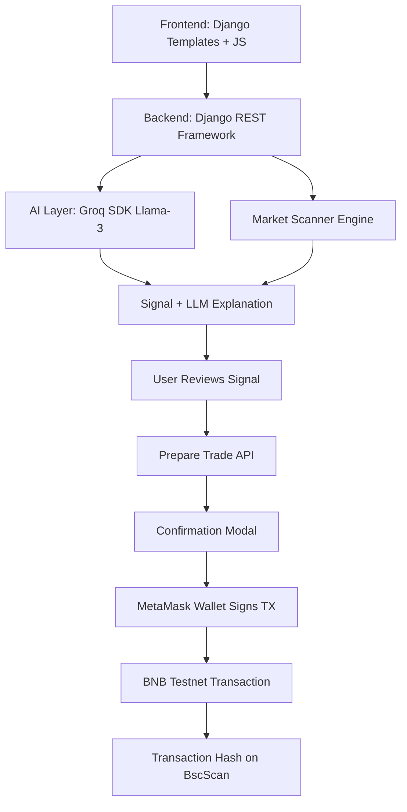

# NeutraYield AI 🚀
### Automated AI Agents That Generate Market-Neutral Yield

**Built for the BNB Hackathon | Institutional Grade Web3 Trading**

NeutraYield AI is a production-ready trading platform that leverages Large Language Models (LLMs) and quantitative execution engines to capture yield across DeFi and CeFi without directional market risk.

---

## 🌟 Key Features
- **🤖 LLM-Powered AI Agent**: Integrated with **Groq SDK (Llama-3)** to analyze yield differences, explain strategy decisions in plain English, and monitor risk levels.
- **🛡️ Delta-Neutral Strategies**: Automated hedging algorithms to maintain market neutrality.
- **📊 Real-Time Strategy Dashboard**: High-fidelity dashboard with performance metrics, risk ratios, and live cross-platform monitoring.
- **🌀 Cross-Chain Yield Rotation**: Automatically rotates capital to the highest-yield opportunities (BNB Chain, ETH, Arbitrum).
- **📝 Transparency Feed (AI Logs)**: Live scrolling logs generated by the AI agent explaining every rebalance and arbitrage captured.
- **🧪 Strategy Simulation**: Backtesting and Monte Carlo risk models built into the UI.
- **🦊 MetaMask Wallet Integration**: Secure wallet signing — no private keys stored server-side.
- **📡 Real BNB Testnet Transactions**: Every trade is a real on-chain transaction, verifiable on BscScan.

## 🔐 Security Architecture (Web3 Best Practices)

- ❌ **No private key input fields** — all signing via MetaMask
- ❌ **No server-side transaction signing** — backend never touches keys
- ❌ **No wallet secrets stored** — zero-knowledge approach
- ✅ **User wallet signature required** for every trade
- ✅ **Network validation** — blocks execution on wrong chain
- ✅ **Real transaction hashes** with clickable BscScan links
- ✅ **try/catch** around all wallet requests
- ✅ **chainId validation** before sending any transaction

## 🛠️ Technical Architecture
```
Frontend (Django Templates + Vanilla JS)
    ↓
Market Scanner Engine (Rule-based Analysis)
    ↓
Groq LLM (Backend API - AI Explanation)
    ↓
Signal Generated (BUY/SELL/STOP/LIMIT)
    ↓
User Clicks "Prepare Trade"
    ↓
Confirmation Modal (Signal, Confidence, Risk, Gas)
    ↓
MetaMask Wallet Signs Transaction
    ↓
BNB Testnet Transaction Broadcast
    ↓
Transaction Hash Returned → BscScan Link
```

### Flow Diagram


## 🏗️ Tech Stack
- **Backend**: Django (Python 3.10+)
- **Database**: SQLite3
- **AI Inference**: Groq API (Incredible speed for real-time agent reasoning)
- **Frontend**: Django Templates + CSS Glassmorphism + Chart.js
- **Wallet**: MetaMask (via `window.ethereum` API)
- **Network**: BNB Chain Testnet (Chain ID: 97)
- **Explorer**: [BscScan Testnet](https://testnet.bscscan.com/)
- **Environment**: Secure `.env` handling (no private keys!)

---

## 🚀 Getting Started

### 1. Prerequisite
- Python 3.10+ installed
- MetaMask browser extension installed
- BNB Testnet added to MetaMask
- Some tBNB for gas (get from [BNB Faucet](https://testnet.bnbchain.org/faucet-smart))

### 2. Installation
```bash
pip install -r requirements.txt
```

### 3. Environment Setup
Create a `.env` file in the root directory (see `.env.example`):
```env
SECRET_KEY=your_django_key
GROQ_API_KEY=your_groq_api_key
BNB_TESTNET_RPC=https://data-seed-prebsc-1-s1.binance.org:8545/
# No WALLET_PRIVATE_KEY needed — MetaMask handles signing!
```

### 4. Database Migrations
```bash
python manage.py makemigrations
python manage.py migrate
```

### 5. Launch the Platform
```bash
python manage.py runserver
```
Visit `http://localhost:8000` to enter the landing page.

### 6. Connect Your Wallet
1. Click **Connect Wallet** in the navbar
2. MetaMask popup appears → Approve connection
3. If not on BNB Testnet → Click "Switch to BNB Testnet"
4. Your wallet address appears in the navbar

### 7. Execute a Trade
1. Click **Scan Market** to get AI-generated signal
2. Click **Prepare Buy/Sell/Stop/Limit**
3. Review the confirmation modal (signal, confidence, risk, gas)
4. Click **Confirm in Wallet** → MetaMask opens
5. Confirm in MetaMask → Transaction hash returned
6. Click the hash to view on BscScan

---

## 🧠 AI Agent Prompting
Our AI agent uses a specific system prompt to ensure institutional tone and risk-first thinking:
> "You are NeutraYield AI, a professional quantitative trading AI agent managing delta-neutral and arbitrage strategies... Explain decisions clearly, conservatively, and transparently."

---

## 📄 License
This project is for the BNB Hackathon. All rights reserved by NeutraYield AI Team.
